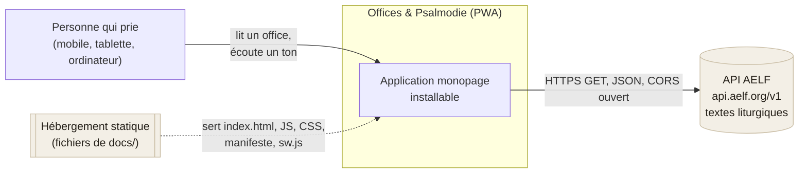
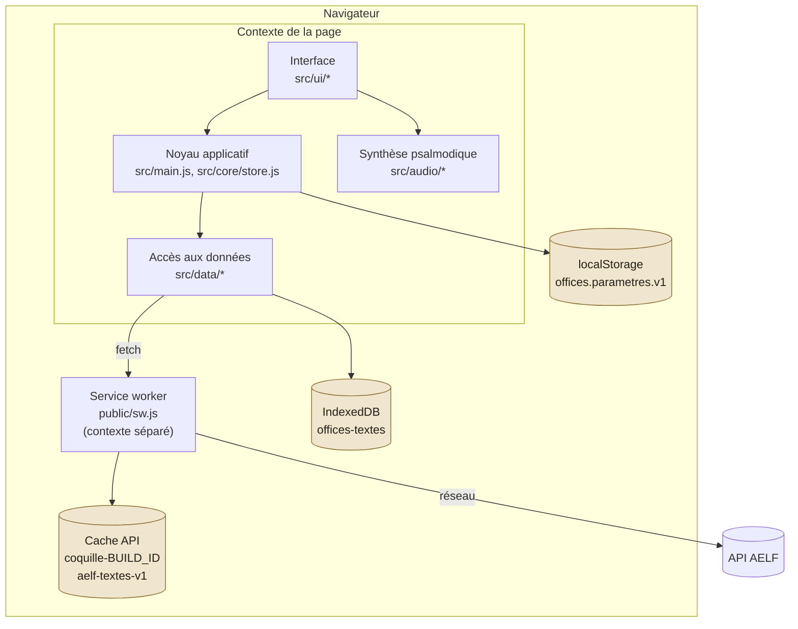
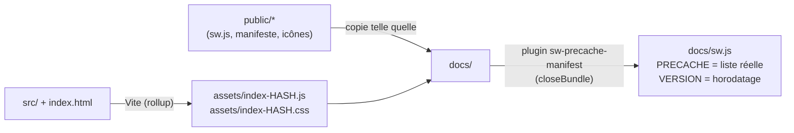

# 01 — Contexte et conteneurs

## Contexte système

Aucun compte, aucune authentification, aucune télémétrie : le seul appel sortant
est la lecture des textes chez l'AELF. Les préférences et les textes conservés
restent dans le navigateur de la personne.

## Conteneurs d'exécution

Le service worker s'interpose sur **toutes** les requêtes de la page une fois
actif : les appels de `data/aelf.js` passent donc par lui, ce qui ajoute un
second filet de sécurité hors connexion (voir [04 — Stockage](04-stockage.md)).

## Vue de déploiement

Contraintes de déploiement :

- **HTTPS obligatoire** (ou `localhost`) : sans lui, ni service worker ni
  installation PWA.
- **Servi à la racine** du domaine : `start_url`, `scope` et l'enregistrement du
  service worker valent `/`. Un déploiement en sous-répertoire demanderait
  d'ajuster `manifest.webmanifest`, `enregistrerServiceWorker()` et `base` dans
  `vite.config.js`.
- **Aucune configuration serveur** : pas de réécriture d'URL nécessaire, la
  navigation interne se fait dans le fragment (`#/…`).

## Chaîne de construction

Le plugin `serviceWorkerManifest()` de `vite.config.js` lit l'arborescence de
`docs/` après l'écriture du bundle, en retire `sw.js` et les fichiers `.map` /
`.txt`, puis remplace dans `sw.js` les deux marqueurs `'__PRECACHE_MANIFEST__'`
et `__BUILD_ID__`. En développement les marqueurs restent en place : la liste est
inerte et le service worker n'est de toute façon pas enregistré.
