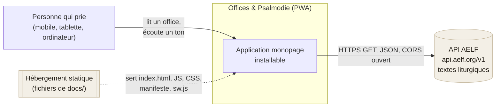
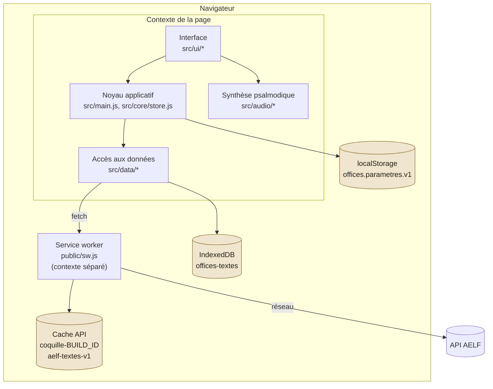
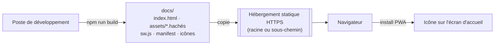
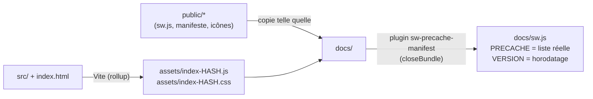

# 01 — Contexte et conteneurs

## Contexte système

Aucun compte, aucune authentification, aucune télémétrie : le seul appel sortant
est la lecture des textes chez l'AELF. Les préférences et les textes conservés
restent dans le navigateur de la personne.

## Conteneurs d'exécution

Le service worker s'interpose sur **toutes** les requêtes de la page une fois
actif : les appels de `data/aelf.js` passent donc par lui, ce qui ajoute un
second filet de sécurité hors connexion (voir [04 — Stockage](04-stockage.md)).

## Vue de déploiement

Contraintes de déploiement :

- **HTTPS obligatoire** (ou `localhost`) : sans lui, ni service worker ni
  installation PWA.
- **Indifférent au préfixe d'URL** : `base: './'` et des références relatives
  partout (`%BASE_URL%` dans la coquille, `start_url`/`scope` relatifs dans le
  manifeste, service worker enregistré sur `${import.meta.env.BASE_URL}sw.js`,
  précache en `./…`). Le même build sert à la racine d'un domaine comme sous
  `<compte>.github.io/<dépôt>/`.
- **Aucune configuration serveur** : pas de réécriture d'URL nécessaire, la
  navigation interne se fait dans le fragment (`#/…`). C'est aussi ce qui rend
  GitHub Pages suffisant : Pages ne sait pas faire de repli SPA.
- **Jekyll désactivé** par le marqueur `docs/.nojekyll`, sans quoi Pages
  écarterait les fichiers commençant par `_`.

Une réplique locale de cet hébergement est fournie (`Dockerfile` +
`docker/pages*.conf`) : nginx y sert `docs/` avec les mêmes règles que Pages, à
la racine sur le port 8080 et sous `/<dépôt>/` sur le port 8081, afin de
vérifier les deux modes de publication avant mise en ligne.

## Chaîne de construction

Le plugin `serviceWorkerManifest()` de `vite.config.js` lit l'arborescence de
`docs/` après l'écriture du bundle, en retire `sw.js` et les fichiers `.map` /
`.txt`, puis remplace dans `sw.js` les deux marqueurs `'__PRECACHE_MANIFEST__'`
et `__BUILD_ID__`. En développement les marqueurs restent en place : la liste est
inerte et le service worker n'est de toute façon pas enregistré.
