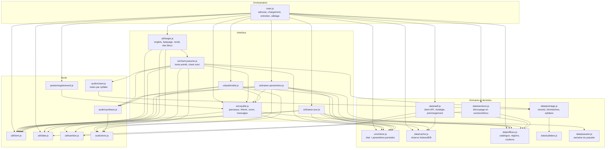

# 02 — Modules

## Couches

## Règles de dépendance

1. **`data/` ne connaît pas `ui/`.** La couche données n'importe jamais un module
   d'interface : elle renvoie des valeurs et lève `ErreurReseau`, c'est
   `main.js` qui décide de l'affichage.
2. **`ui/` ne parle pas au réseau.** Aucun `fetch` dans `src/ui/` ; les tiroirs
   reçoivent leurs actions (`rafraichir`, `telecharger`, `purger`,
   `choisirOffice`, `choisirDate`) en paramètres d'initialisation.
3. **Une seule exception assumée** : `ui/drawer-jour.js` et
   `ui/drawer-parametres.js` lisent `data/cache.js` pour afficher un état
   (pastille « disponible hors connexion », statistiques de la réserve). C'est de
   la lecture d'état, jamais une écriture.
4. **`main.js` est le seul point de câblage.** Il détient `sections`, le jeton
   anti-concurrence et les écouteurs globaux (`hashchange`, `online`,
   `offline`).
5. **Le HTML distant ne traverse jamais une couche sans passer par
   `util/sanitize.js`.** `data/sections.js` transporte le HTML brut dans
   `bloc.html` ; `ui/liturgie.js` ne l'insère qu'à travers `htmlSur()`.

## Rôle de chaque module

### Orchestration

| Module | Responsabilité | Points notables |
| --- | --- | --- |
| `main.js` | Lecture/écriture de l'adresse, chargement d'un office, actions utilisateur, entretien de fond | `jeton` incrémental : une réponse tardive d'un office abandonné est ignorée (`if (mien !== jeton) return`) |

### Interface

| Module | Responsabilité | Points notables |
| --- | --- | --- |
| `ui/coquille.js` | Ouverture/fermeture des trois panneaux, thème jour/nuit, taille du texte, zoom à deux doigts, messages brefs | Mémorise la frame d'ouverture (`panneau.frame`) pour pouvoir l'annuler si l'on referme dans la même frame |
| `ui/liturgie.js` | Onglets de sections, balayage horizontal, rendu d'une section en blocs, états (chargement, erreur) | Le balayage n'est décidé horizontal qu'au-delà de 12 px et si `|dx| > |dy| × 1,4` |
| `ui/drawer-jour.js` | Jour liturgique, navigation de date, liste des offices, pastilles de disponibilité | `marquerDisponibles()` s'interrompt si la date a changé pendant l'attente |
| `ui/drawer-parametres.js` | Tous les réglages, barre de progression du téléchargement, statistiques de la réserve | Se redessine entièrement à chaque changement de segment (état unique : `store.parametres`) |
| `ui/psalmodie.js` | Feuille du bas : ton, instrument, hauteur, portée SVG, écoute | La portée est centrée sur l'ambitus du ton (`milieuAmbitus - 4`) |
| `ui/chant-psaume.js` | Vue pointée d'un psaume, notes au-dessus des syllabes, chant suivi | Renonce au pointage si le texte reconstruit s'écarte de celui de l'AELF |

### Domaine et données

| Module | Responsabilité | Points notables |
| --- | --- | --- |
| `core/store.js` | `store.parametres` (persistés), `store.vue`, `store.jour`, abonnements | Écriture `localStorage` protégée : navigation privée ⇒ réglages en mémoire seulement |
| `data/aelf.js` | `chargerOffice`, `chargerBible`, `precharger`, `reseauAutorise`, `ErreurReseau` | Délai de 12 s par requête via `AbortController` |
| `data/cache.js` | Réserve IndexedDB : lecture, écriture, présence, statistiques, purge | Garde-fou de 3 s à l'ouverture, puis `horsService` pour la session |
| `data/offices.js` | Catalogue des 9 entrées, 7 zones AELF, couleurs liturgiques, `officeDuMoment()` | Table de couleurs distincte en mode nuit |
| `data/sections.js` | Transformation d'une réponse AELF en `Section[]` / `Bloc[]` | Plan unique pour toutes les heures ; les sections vides disparaissent |
| `data/pointage.js` | Découpage d'un psaume en versets, lignes et syllabes accentuées | S'appuie sur le pointage que l'AELF fournit déjà (`<u>`, `*`, `+`) |
| `data/psautier.js` | Semaine du psautier (I à IV) d'un jour donné | Renvoie « inconnu » plutôt que de deviner ; voir [fondations](../fondations/psautier-et-tons.md) |
| `data/syllabes.js` | Découpage syllabique du français | Règles scolaires ; la reconstruction du mot est toujours exacte |

### Socle

| Module | Responsabilité |
| --- | --- |
| `util/dom.js` | `el()` (création déclarative), `vider()`, `$()`, `icone()` et la table `ICONES` |
| `util/date.js` | Dates ISO **locales** (jamais `toISOString`), étiquettes « Aujourd'hui / Demain / Hier », formats `fr-CA` |
| `util/sanitize.js` | `htmlSur()` (liste blanche), `texteBrut()`, `aDuContenu()` |
| `audio/tons.js` | Les 9 formules psalmodiques (intonation, teneur, flexe, médiante, terminaison), conversion note → MIDI → hertz |
| `audio/chant.js` | Attribution d'une note à chaque syllabe d'un verset |
| `audio/synthese.js` | Trois timbres additifs WebAudio, enveloppes, `jouerTon()` / `arreter()` |
| `pwa/enregistrement.js` | Enregistrement du service worker en production uniquement |

## Poids et périmètre

| Élément | Mesure |
| --- | --- |
| Code source `src/` + `public/sw.js` + `index.html` | ≈ 3 400 lignes |
| Bundle JS de production | 47 ko (17 ko gzip) |
| Feuille de style | 15,2 ko (4,0 ko gzip) |
| Dépendances d'exécution | 0 |
| Dépendances de développement | 1 (`vite`) |
