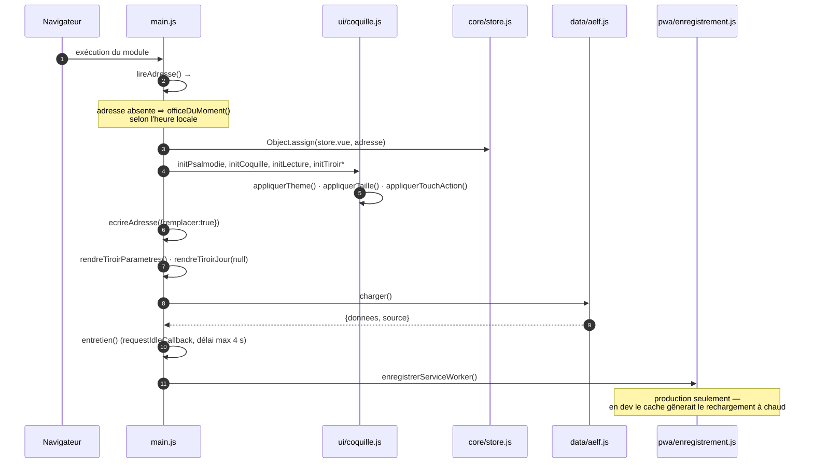
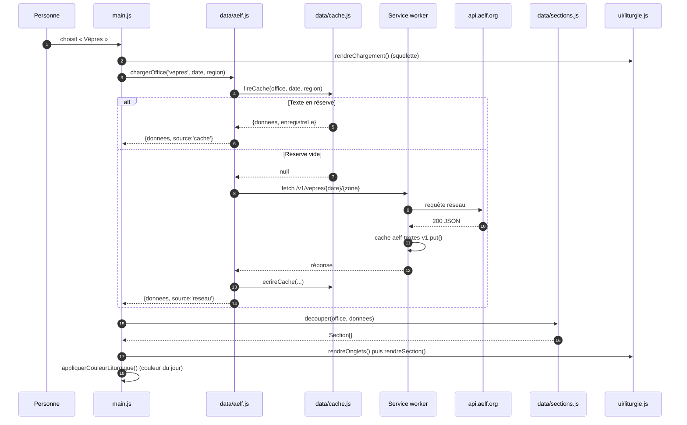
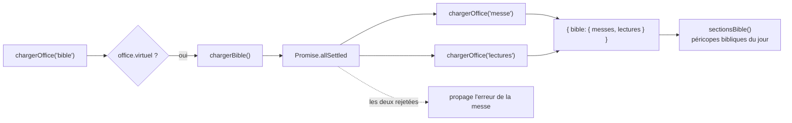
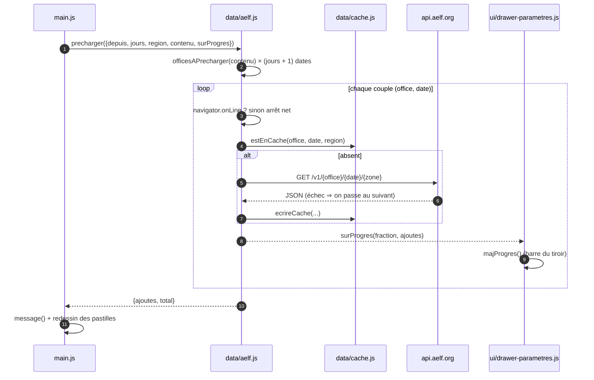
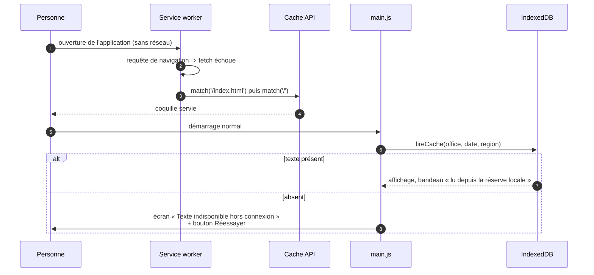
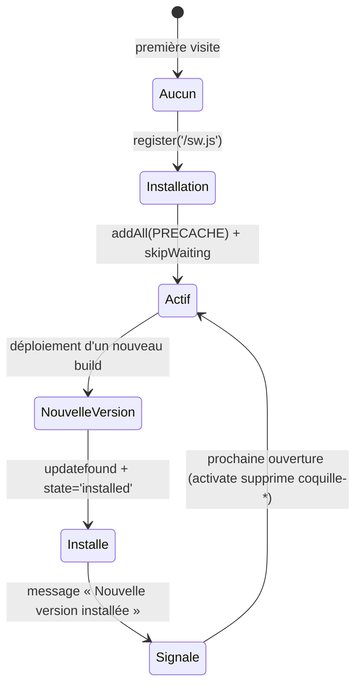

# 03 — Flux

## Démarrage de l'application

## Lecture d'un office — cache d'abord

Le délai réseau est de 12 s (`AbortController`). Toute erreur — abandon, statut
non-2xx, hôte injoignable — est convertie en `ErreurReseau`, avec l'indicateur
`horsLigne` positionné quand `navigator.onLine` est faux.

## Cas particulier : l'entrée « Bible »

L'AELF n'expose pas de point d'accès « Bible » : la vue est composée des
lectures bibliques de la messe (hors séquence) et de la lecture de l'office des
lectures. Si une seule des deux sources répond, la vue s'affiche quand même.

## Préchargement (téléchargement à l'avance)

Deux déclencheurs :

| Déclencheur | Respecte « WiFi uniquement » | Point de départ |
| --- | --- | --- |
| Entretien au démarrage (`entretien()`) | **Oui** — `reseauAutorise()` bloque sinon | Aujourd'hui |
| Bouton « Lancer » du tiroir | Non — geste explicite, un message avertit simplement | Date affichée |

`reseauAutorise()` : hors ligne ⇒ non ; réglage inactif ⇒ oui ; `saveData` ⇒
non ; `connection.type` connu ⇒ `wifi`/`ethernet` seulement ; sinon repli sur
`effectiveType === '4g'`.

## Hors connexion

Au retour du réseau (`window.online`), `main.js` relance `charger({forcerReseau:
true})` si le dernier chargement avait échoué, sinon il se contente de
redessiner la section pour retirer le bandeau.

## Mise à jour de l'application

Le nom du cache de coquille contient l'horodatage du build (`coquille-<BUILD_ID>`) :
un nouveau build crée donc un nouveau cache, et `activate` supprime les
précédents. Le cache des textes (`aelf-textes-v1`) survit aux déploiements.
