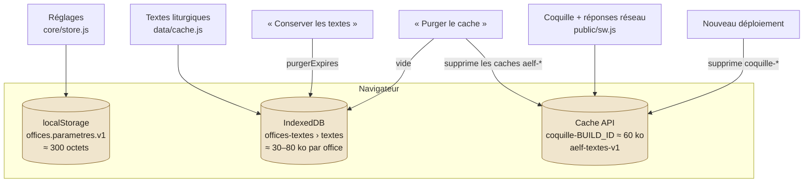
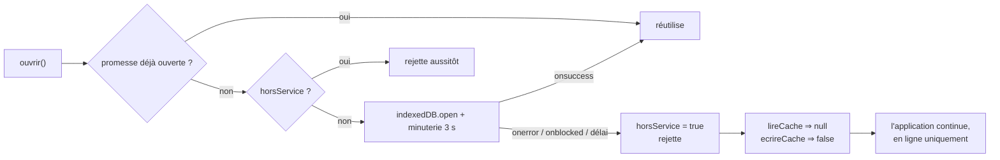
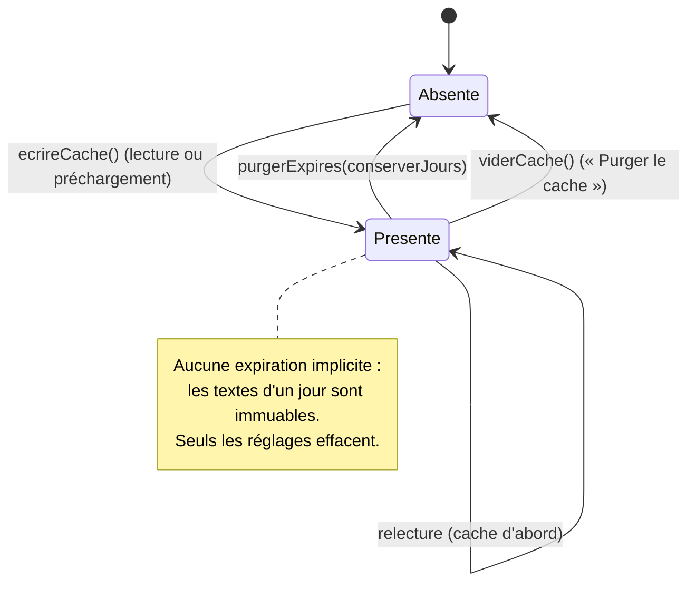
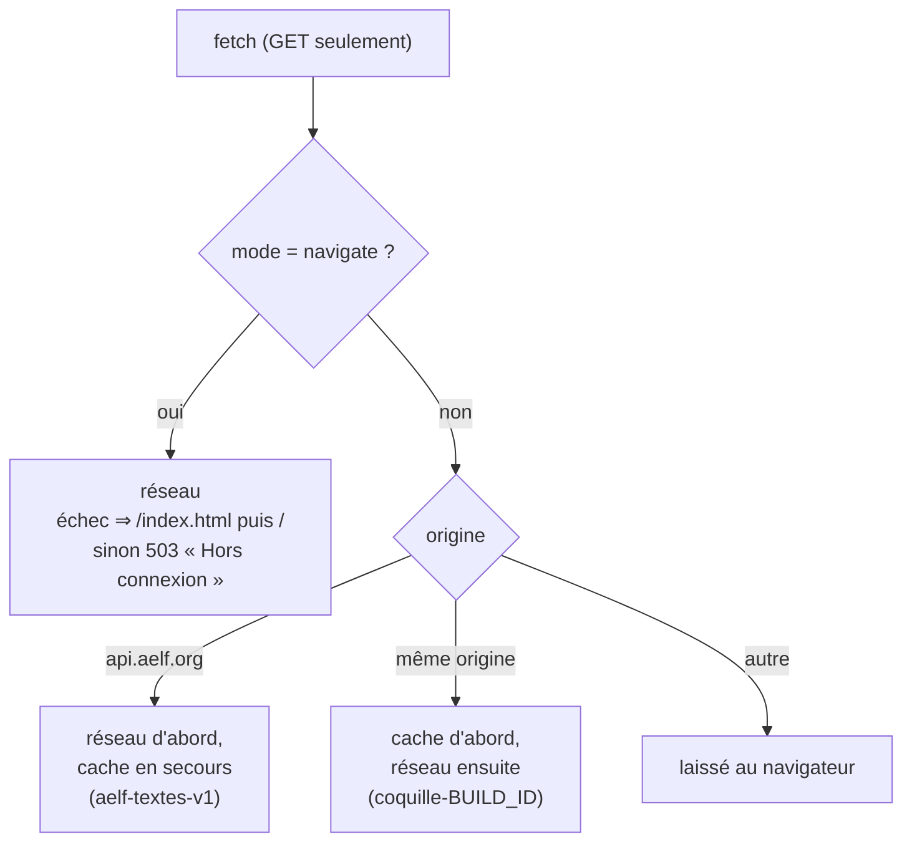

# 04 — Stockage et caches

Trois stockages distincts, trois cycles de vie, trois responsables.

## localStorage — les réglages

| Aspect | Valeur |
| --- | --- |
| Clé | `offices.parametres.v1` |
| Contenu | L'objet `store.parametres` sérialisé |
| Écriture | `reglerParametre()`, à chaque changement |
| Lecture | Une seule fois, au chargement du module `core/store.js` |
| Robustesse | Lecture et écriture sous `try/catch` : en navigation privée les réglages vivent en mémoire pour la session |
| Migration | Le suffixe `.v1` réserve la place d'une future migration ; les clés inconnues d'une version antérieure sont écrasées par la fusion avec les valeurs par défaut |

## IndexedDB — la réserve de textes

| Aspect | Valeur |
| --- | --- |
| Base | `offices-textes`, version `1` |
| Magasin | `textes`, `keyPath: 'cle'` |
| Clé | `` `${office}\|${date}\|${region}` `` — ex. `laudes\|2026-08-25\|france` |
| Index | `enregistreLe` (horodatage), utilisé par la purge par ancienneté |
| Enregistrement | `{ cle, office, date, region, donnees, enregistreLe }` où `donnees` est la réponse AELF intacte |
| Ouverture | Garde-fou de 3 s ; en cas d'échec, `horsService` coupe le cache pour la session et la lecture se poursuit en ligne |

Deux pièges corrigés dans cette couche, à ne pas réintroduire :

1. **`transaction()` doit tester `resultat instanceof IDBRequest`**, pas la
   valeur : `resultat?.result ?? resultat` renvoyait l'objet `IDBRequest`
   lui-même — truthy — pour une clé absente, et faisait échouer tout premier
   chargement sur cache vide.
2. **`lireCache()` valide `entree?.donnees`** avant de renvoyer l'entrée : une
   entrée tronquée est traitée comme absente plutôt que propagée.

### Cycle de vie d'une entrée

`purgerExpires(jours)` s'exécute au démarrage, dans `entretien()`. La valeur `0`
(« Toujours ») désactive la purge. Le parcours se fait au curseur sur l'index
`enregistreLe`, borné par `IDBKeyRange.upperBound(limite)`.

## Cache API — la coquille et les réponses réseau

| Cache | Rempli par | Contenu | Supprimé par |
| --- | --- | --- | --- |
| `coquille-<BUILD_ID>` | `install` (`addAll(PRECACHE)`) puis requêtes de même origine | `/`, HTML, JS, CSS, manifeste, icônes | `activate` du build suivant |
| `aelf-textes-v1` | Réponses de `api.aelf.org` | JSON des offices | `viderCache()` (préfixe `aelf-`) |

Stratégies par type de requête :

Le choix « cache d'abord » pour les fichiers de même origine est sûr parce que
Vite hache leurs noms : un fichier donné est immuable, et un déploiement change
l'URL en même temps que le cache.

## Ce qui n'est jamais stocké

Aucune donnée personnelle, aucun identifiant, aucun historique de lecture.
`documentation/requis/ENF-exigences-non-fonctionnelles.md` en fait une exigence
explicite (ENF-SEC-03).
