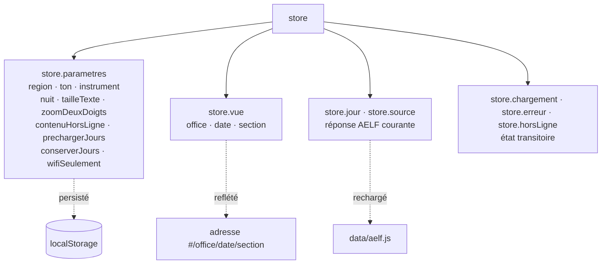
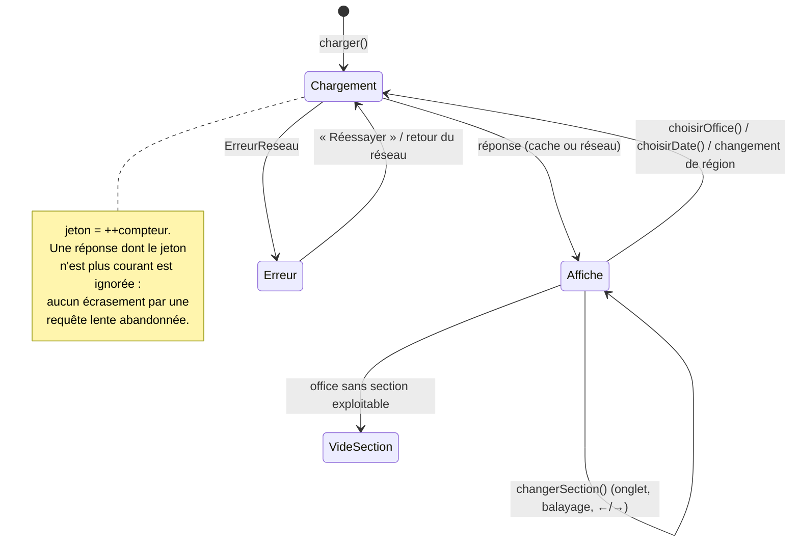
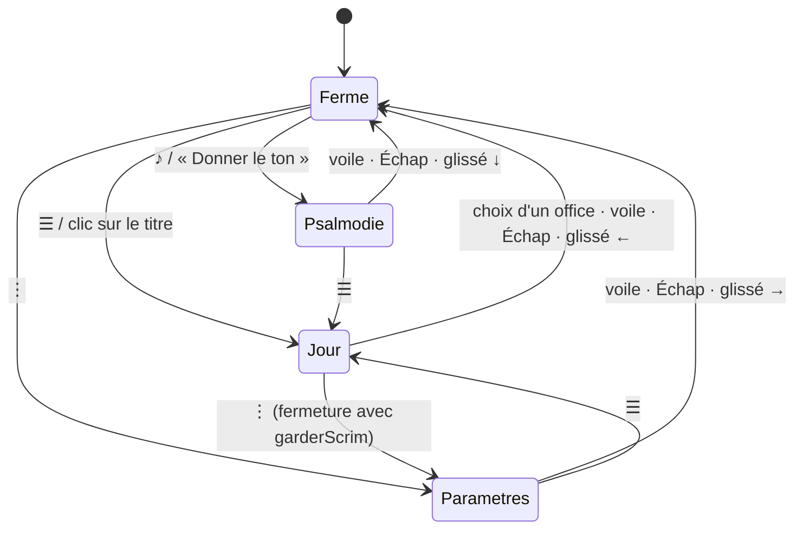
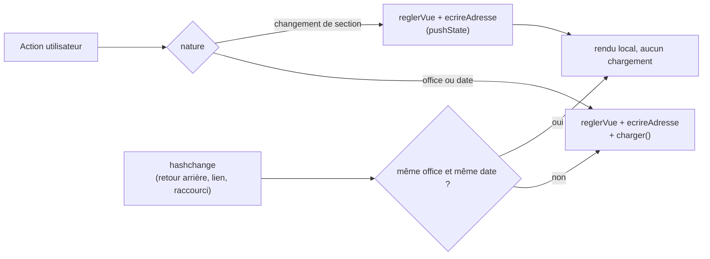
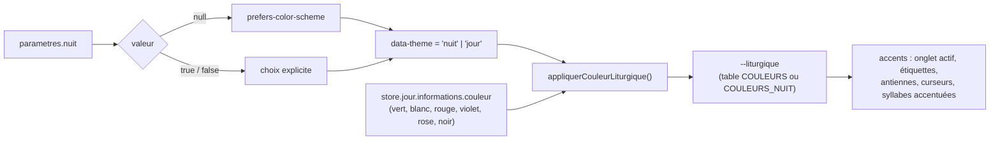

# 05 — États de l'interface et navigation

## État applicatif

L'état vit en un seul endroit, `core/store.js`, et se divise en trois :

`sections` (le résultat de `decouper()`) n'est **pas** dans le store : c'est une
valeur dérivée, détenue par `main.js` et recalculée à chaque chargement.

Deux fonctions de mutation, deux notifications :

| Fonction | Effet | Raison notifiée |
| --- | --- | --- |
| `reglerParametre(champs)` | Fusionne, persiste, notifie | `'parametres'` |
| `reglerVue(champs)` | Fusionne, notifie | `'vue'` |

## Cycle de vie de la vue de lecture

L'écran d'erreur distingue deux causes, parce que le remède diffère :

| Condition | Titre | Conseil donné |
| --- | --- | --- |
| `erreur.horsLigne` ou `!navigator.onLine` | Texte indisponible hors connexion | Se reconnecter, ou activer le téléchargement à l'avance |
| Sinon | Texte indisponible | L'AELF n'a pas répondu, réessayer |

## Panneaux : un seul ouvert à la fois

`ouvrirPanneau()` retarde d'une frame l'ajout de la classe `is-open` pour que la
transition parte de l'état fermé. Cette frame est mémorisée dans `panneau.frame`
et **annulée** par `fermerPanneau()` : sans cela, ouvrir puis refermer dans la
même frame — choisir un office aussitôt après avoir ouvert le tiroir — laissait
le tiroir ouvert alors que l'état interne le croyait fermé.

Le passage direct d'un panneau à l'autre utilise `fermerPanneau({garderScrim:
true})` afin que le voile ne clignote pas.

## Navigation par adresse

Format : `#/{office}/{AAAA-MM-JJ}/{section}` — par exemple
`#/vepres/2026-08-25/3`.

Règles de lecture (`lireAdresse()`), tolérantes par construction :

| Élément absent ou invalide | Valeur retenue |
| --- | --- |
| Office | `officeDuMoment()` selon l'heure locale |
| Date | Aujourd'hui (date **locale**, jamais UTC) |
| Section | `0` |

Les raccourcis du manifeste (`./#/laudes`, `./#/vepres`, `./#/complies`,
`./#/messe`) exploitent cette tolérance : ils ne donnent que l'office, la date et
la section sont déduites.

## Thème et couleur liturgique

La couleur du jour vient de la réponse AELF ; en mode nuit une table éclaircie
prend le relais pour rester lisible sur fond sombre. En l'absence de couleur
connue, l'accent revient à l'or par défaut.
