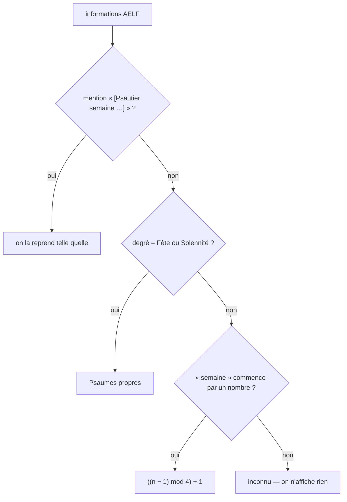

# Psautier et tons psalmodiques

Ce que la semaine détermine, comment se choisit le ton, pourquoi l'usage varie
d'une église à l'autre, et ce qui change aux fêtes. Les affirmations sont
appuyées sur la *Présentation générale de la Liturgie des Heures* (PGLH) et
vérifiées sur les données réelles de l'API AELF.

## 1. La semaine détermine les psaumes, jamais le ton

Les psaumes des offices tournent sur un **psautier de quatre semaines**
(PGLH n° 126). Le cycle repart à la semaine I « le premier dimanche de l'Avent,
la première semaine du Temps ordinaire, le premier dimanche de Carême, le
dimanche de Pâques » ; et « pendant le Temps ordinaire, le cycle du psautier
suit la série des semaines » (n° 133).

D'où la règle de calcul, telle qu'implémentée dans `data/psautier.js` :

```
semaine du psautier = ((numéro de semaine liturgique − 1) mod 4) + 1
```

### Vérification sur les données de l'AELF

Vêpres du mardi, zone France :

| Date | Semaine liturgique | Psautier | Psaumes des vêpres |
| --- | --- | --- | --- |
| 25 août 2026 | 21ᵉ du Temps ordinaire | I | 19, 20 |
| 1ᵉʳ septembre 2026 | 22ᵉ | II | 48 I et II |
| 22 septembre 2026 | 25ᵉ | I | 19, 20 — **identiques à quatre semaines d'écart** |
| 8 septembre 2026 (Nativité de la Vierge, **fête**) | *aucune* | *aucun* | 121, 126 |

La dernière ligne illustre la règle des fêtes : « Pendant le Triduum pascal, aux
jours des octaves de Pâques et de Noël, ainsi qu'aux solennités et aux fêtes, il
y a des psaumes propres, avec leurs antiennes propres. En revanche, aux
dimanches et aux féries, les psaumes avec leurs antiennes sont pris dans le
cycle ordinaire du psautier » (n° 62).

### Cas que le calcul ne couvre pas



Le champ `semaine` est vide au Temps de Noël, dans les octaves et les jours qui
suivent les Cendres. L'AELF indique alors parfois elle-même « [Psautier semaine
propre] ». Quand rien ne permet de conclure, **l'application n'affiche rien**
plutôt que de deviner.

## 2. Le ton se choisit par l'antienne

C'est le point décisif, et il n'a rien d'intuitif : **le ton n'appartient pas au
psaume, il appartient à l'antienne.**

- Le mode de l'antienne impose le ton : antienne du 1ᵉʳ mode → psaume au ton I,
  du 2ᵉ mode → ton II, et ainsi de suite.
- À l'intérieur d'un ton, on retient une **différence** (*differentia*), c'est-à-dire
  une terminaison parmi plusieurs — une cinquantaine de formules en tout, notées
  par le mode et leur finale : `1G`, `8G`, `4E`…
- Son rôle est pratique : faire que la **dernière note du verset amène la
  première note de l'antienne** que l'on va reprendre.

La PGLH le dit à sa manière lorsqu'elle décrit ce que l'antienne apporte : elle
« aide à mettre en lumière le genre littéraire du psaume », « donne à l'un ou
l'autre psaume une nuance particulière selon les circonstances » et « seconde
efficacement l'interprétation typologique ou correspondant à la fête » (n° 113).
Aux fêtes, « leur convenance est mise en lumière, la plupart du temps, par
l'antienne » (n° 134).

**Conséquence directe pour l'application** : l'AELF publie le *texte* des
antiennes, jamais leur *mélodie* ni leur mode. Le ton ne peut donc pas être
déduit des données — le choix revient à l'utilisateur, et l'application le
mémorise **par office** (`store.parametres.tonsParOffice`), parce qu'on ne
chante pas les laudes et les complies sur le même ton.

## 3. Pourquoi l'usage change d'une église à l'autre

Quatre causes qui se cumulent :

| Cause | Effet |
| --- | --- |
| **Cursus différents** | L'office monastique (psautier sur une semaine) et l'office romain (quatre semaines) n'ont ni les mêmes psaumes ni les mêmes antiennes aux mêmes jours |
| **Livres différents** | *Antiphonale Romanum*, *Antiphonale Monasticum*, *Liber usualis* : les différences notées pour une même antienne ne coïncident pas toujours |
| **La langue vivante** | PGLH n° 275 : « Puisque la Liturgie des heures peut être accomplie en langue vivante, on devra faire le nécessaire pour **préparer les mélodies** dont on se servira dans le chant de l'office en langue du pays. » L'Église demande donc que chaque aire linguistique constitue son propre répertoire : il n'existe pas de tons français uniques. D'où la psalmodie de Gelineau, les adaptations de Solesmes, la psalmodie rythmée de Keur Moussa, les tons propres à telle ou telle communauté |
| **La solennité progressive** | PGLH n° 271-273 : chaque communauté module ce qu'elle chante « d'après la couleur du jour ou de l'heure », d'après le nombre de chanteurs. Une communauté qui récite l'antienne au lieu de la chanter n'a plus de mode imposé, et choisit son ton librement |

S'y ajoutent des raisons concrètes : la tessiture de l'assemblée, l'instrument
disponible, l'habitude du lieu.

## 4. Les fêtes : pas de ton prescrit, mais un traitement propre

Aucune rubrique n'attache un ton à une fête. Ce qui change :

- **L'antienne est propre**, donc son mode aussi : le ton suit (n° 134).
- **Le degré de chant marque le degré de fête** : « il importe avant tout qu'on
  chante l'office au moins les dimanches et jours de fête, et que la pratique du
  chant contribue à distinguer les différents degrés de solennité » (n° 271).
- **Les cantiques évangéliques se disent « solennellement, avec leur antienne »**
  (n° 50) — d'où, dans la tradition, des **tons solennels** plus ornés pour le
  *Magnificat* et le *Benedictus* aux jours de fête, celui du 8ᵉ ton étant le
  plus répandu.
- **Quelques attributions traditionnelles tiennent au texte, non à la date** :
  le **ton pérégrin**, à deux teneurs et hors des huit modes, pour le psaume 113
  *In exitu Israel* aux vêpres du dimanche, parfois pour le *Benedictus*.
- **Les psaumes changent de source** : aux premières vêpres des solennités, les
  psaumes sont de la série *Laudate* ; aux laudes, on prend ceux du premier
  dimanche du psautier (n° 134).

## 5. Ce que l'application en fait

| Élément | Réalisation |
| --- | --- |
| Semaine du psautier | Calculée par `data/psautier.js`, affichée dans le tiroir « Jour » et en tête de la zone de lecture ; « Psaumes propres » aux fêtes ; rien quand le calendrier ne permet pas de conclure |
| Ton par office | `store.parametres.tonsParOffice`, alimenté par la feuille Psalmodie ; le ton des paramètres sert de repli |
| Note d'usage | Dépliant « Comment se choisit le ton ? » dans la feuille Psalmodie, qui reprend l'essentiel de ce document |
| Ce que l'application ne fait pas | Elle ne devine pas le mode de l'antienne, faute de mélodie dans les données ; elle ne propose pas les tons solennels des cantiques ; elle ne connaît pas les différences (*differentiae*) |

Voir [SPEC-04 — Psalmodie](../specs/SPEC-04-psalmodie.md) pour la mécanique du
pointage et du chant.

## Sources

- [PGLH — Présentation générale de la Liturgie des Heures](https://liturgie.catholique.fr/wp-content/uploads/sites/11/import/pdf/import-PRESENTATION_GENERALE_DE_LA_LITURGIE_DES_HEURES.pdf) — nn. 50, 62, 113, 121-125, 126, 133, 134, 271-275
- [Psalmodie — Wikipédia](https://fr.wikipedia.org/wiki/Psalmodie) — modes, différences, structure d'un ton
- [Ton pérégrin — Wikipédia](https://fr.wikipedia.org/wiki/Ton_p%C3%A9r%C3%A9grin)
- [Les psaumes — Liturgie & Sacrements](https://liturgie.catholique.fr/celebrer-en-toutes-occasions-sacramentaux/liturgie-des-heures/la-structure-fondamentale/les-psaumes/)
- [Les cantiques évangéliques — Liturgie & Sacrements](https://liturgie.catholique.fr/celebrer-en-toutes-occasions-sacramentaux/liturgie-des-heures/la-structure-fondamentale/les-cantiques-evangeliques/)
- [La répartition des psaumes dans le cycle liturgique (LMD 105)](https://www.ressources-liturgiques.fr/liturgie/liturgie-des-heures/heures-lmd-105-la-repartition-des-psaumes.pdf)
- [Méthode de psalmodie rythmée — Abbaye de Keur Moussa](https://www.abbaye-keur-moussa.com/wp-content/uploads/2024/12/Methode-de-psalmodie-ryhmee.pdf)
- [Gelineau psalmody — Wikipedia](https://en.wikipedia.org/wiki/Gelineau_psalmody)
- [Les huit modes grégoriens — Centre grégorien Saint-Pie-X](https://www.centre-gregorien-saint-pie-x.fr/index.php/dossiers/modalite/157-modalite4-ochtoechos)
- [Formes musicales — Abbaye de Solesmes](https://www.abbayedesolesmes.fr/formes-musicales)
