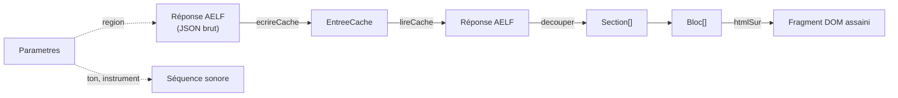
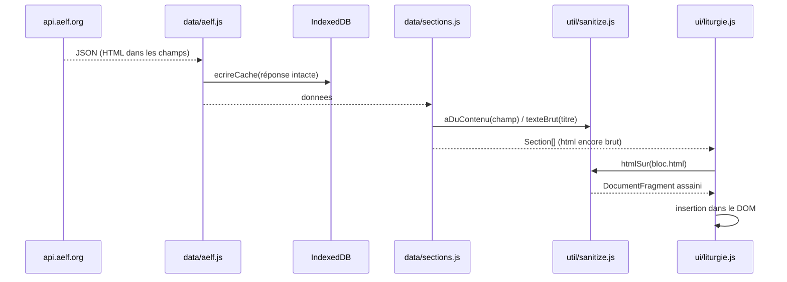

# SPEC-02 — Modèle de données

## Vue d'ensemble



## `Parametres` — persistés

Clé `localStorage` : `offices.parametres.v1`.

| Champ | Type | Défaut | Valeurs | Effet |
| --- | --- | --- | --- | --- |
| `region` | `string` | `'france'` | `romain`, `france`, `canada`, `belgique`, `luxembourg`, `suisse`, `afrique` | Zone AELF interrogée ; participe à la clé de cache |
| `ton` | `string` | `'II'` | `I`…`VIII`, `peregrinus` | Ton proposé par la feuille psalmodie |
| `instrument` | `string` | `'piano'` | `piano`, `orgue`, `voix` | Timbre de la synthèse |
| `nuit` | `boolean \| null` | `null` | `null` = suit le système | Thème `data-theme` |
| `tailleTexte` | `number` | `1` | `0,80` → `2,20` | Variable CSS `--texte-scale` |
| `zoomDeuxDoigts` | `boolean` | `true` | | Pincement géré par l'application ou par le navigateur |
| `contenuHorsLigne` | `string` | `'messe+offices'` | `aucun`, `messe`, `offices`, `messe+offices` | Ce que le préchargement conserve |
| `prechargerJours` | `number` | `3` | `0`, `1`, `3`, `7` | Nombre de jours **après** le jour de départ |
| `conserverJours` | `number` | `30` | `7`, `30`, `90`, `0` (= toujours) | Ancienneté au-delà de laquelle une entrée est purgée |
| `wifiSeulement` | `boolean` | `false` | | Bride le préchargement automatique |

Les valeurs inconnues d'une version antérieure sont complétées par fusion avec
les valeurs par défaut à la lecture.

## `Vue` — état de navigation

| Champ | Type | Exemple | Source de vérité |
| --- | --- | --- | --- |
| `office` | `string` | `'vepres'` | Adresse `#/office/date/section` |
| `date` | `string` | `'2026-08-25'` | idem, format ISO **local** |
| `section` | `number` | `2` | idem, borné à `[0, sections.length - 1]` |

## Catalogue des offices

| `id` | Nom affiché | `api` | Groupe | Heure indicative |
| --- | --- | --- | --- | --- |
| `messe` | Messe | `messes` | Le jour | — |
| `bible` | Bible | *(virtuel)* | Le jour | — |
| `lectures` | Office des lectures | `lectures` | Heures | — |
| `laudes` | Laudes | `laudes` | Heures | 06 h |
| `tierce` | Tierce | `tierce` | Heures | 09 h |
| `sexte` | Sexte | `sexte` | Heures | 12 h |
| `none` | None | `none` | Heures | 15 h |
| `vepres` | Vêpres | `vepres` | Heures | 18 h |
| `complies` | Complies | `complies` | Heures | 21 h |

`officeDuMoment()` — office proposé quand l'adresse n'en donne pas :

| Heure locale | Office |
| --- | --- |
| 00 h – 04 h | Complies |
| 05 h – 07 h | Laudes |
| 08 h – 10 h | Tierce |
| 11 h – 13 h | Sexte |
| 14 h – 16 h | None |
| 17 h – 19 h | Vêpres |
| 20 h – 23 h | Complies |

## `EntreeCache` — IndexedDB

```js
{
  cle: 'laudes|2026-08-25|france', // clé primaire
  office: 'laudes',
  date: '2026-08-25',
  region: 'france',
  donnees: { /* réponse AELF intacte */ },
  enregistreLe: 1787702471297      // ms, indexé
}
```

La réponse est stockée **telle quelle** : aucune transformation n'est figée sur
disque, si bien qu'une évolution de `decouper()` s'applique aussitôt aux textes
déjà conservés.

## `Section` et `Bloc`

```js
Section = {
  titre: 'Premier psaume',   // titre long (en-tête de la zone de lecture)
  court: 'Ps 1',             // libellé de l'onglet
  blocs: Bloc[]
}

Bloc = {
  genre: 'antienne' | 'psaume' | 'hymne' | 'lecture' | 'repons'
       | 'introduction' | 'priere',
  etiquette: 'Antienne',     // petites capitales au-dessus du bloc
  titre: string | null,
  ref: string | null,        // « Psaume 23 », « Mt 23, 23-26 »
  html: string,              // HTML brut de l'AELF, assaini à l'insertion
  source: string | null,     // « D. Rimaud — CNPL », ou l'intro lue
  psalmodiable: boolean      // affiche le bouton « Donner le ton »
}
```

`genre` pilote la mise en forme (encadré d'antienne, encre atténuée des répons…) ;
`etiquette` est purement textuelle.

## Règles de découpage

### Heures (laudes, tierce, sexte, none, vêpres, complies, office des lectures)

Un plan unique, appliqué à toutes les heures ; **les sections sans contenu
disparaissent**, ce qui suffit à couvrir des structures très différentes (Tierce
n'a ni cantique évangélique ni intercession, Complies a une hymne mariale).

| Section | Libellé court | Champs AELF |
| --- | --- | --- |
| Ouverture | `Ouverture` | `introduction`, `antienne_invitatoire`, `psaume_invitatoire`, `hymne` |
| Premier psaume | `Ps 1` | `antienne_1`, `psaume_1` |
| Deuxième psaume | `Ps 2` | `antienne_2`, `psaume_2` |
| Troisième psaume | `Ps 3` | `antienne_3`, `psaume_3` |
| Parole de Dieu | `Parole` | `verset_psaume`, `pericope`, `repons` |
| Lecture biblique | `Lecture` | `lecture`, `repons_lecture` |
| Lecture patristique | `Patristique` | `texte_patristique`, `repons_patristique`, `te_deum` |
| Cantique évangélique | `Cantique` | `antienne_zacharie`/`cantique_zacharie`, `antienne_magnificat`/`cantique_mariale`, `antienne_symeon`/`cantique_symeon` |
| Prières | `Prières` | `intercession`, `notre_pere`, `oraison`, `benediction`, `hymne_mariale` |

Particularités :

- `titre_patristique` n'est pas un bloc : son texte devient le **titre** du bloc
  de lecture patristique.
- `notre_pere` ne contient que la mention « Notre Père » côté AELF : le texte
  intégral est fourni par l'application (constante `NOTRE_PERE`).
- Une référence purement numérique devient « Psaume N » ; une référence
  commençant par `CANTIQUE` fait basculer l'étiquette de « Psaume » à
  « Cantique » (l'AELF loge parfois un cantique dans un champ `psaume_n`).

### Messe

Une section par lecture, dans l'ordre renvoyé par l'API.

| `type` AELF | Libellé |
| --- | --- |
| `lecture_1` … `lecture_4` | 1ʳᵉ … 4ᵉ lecture |
| `psaume` | Psaume |
| `cantique` | Cantique |
| `sequence` | Séquence |
| `evangile` | Évangile |

Blocs produits pour une lecture : le **refrain psalmique** ou l'**acclamation**
d'évangile d'abord (traités comme des antiennes, avec leur référence), puis le
texte, dont la « source » est l'intro lue (« Lecture de la deuxième lettre de
saint Paul… »). Quand le jour comporte plusieurs messes, le titre de section est
préfixé du nom de la messe.

### Bible (vue composée)

Sections = lectures bibliques de la messe (la séquence est exclue), titrées par
leur référence (« Jr 1, 1-19 »), suivies de la lecture de l'office des lectures.

## Cycle d'un texte, de l'API à l'écran


