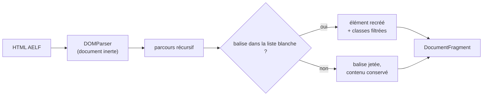
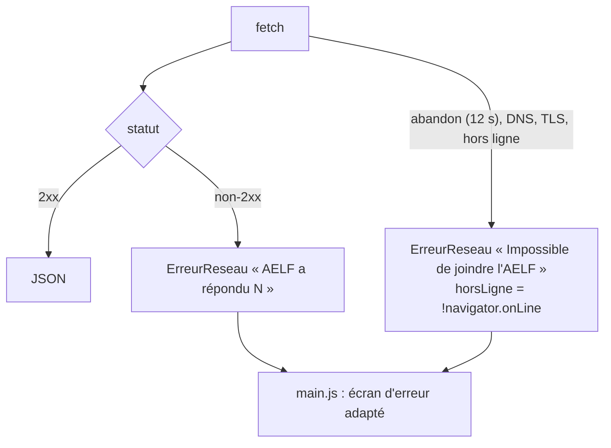

# SPEC-03 — Intégration de l'API AELF

## Contrat externe

| Aspect | Valeur |
| --- | --- |
| Racine | `https://api.aelf.org/v1` |
| Méthode | `GET`, en-tête `Accept: application/json` |
| Authentification | Aucune |
| CORS | `access-control-allow-origin: *` (vérifié) |
| Cache HTTP amont | `cache-control: public, max-age=86400` |
| Délai côté application | 12 000 ms (`AbortController`) |

### Points d'accès utilisés

```
/v1/{office}/{AAAA-MM-JJ}/{zone}
```

`office` ∈ `messes`, `lectures`, `laudes`, `tierce`, `sexte`, `none`, `vepres`,
`complies`. Le point d'accès `informations` existe mais n'est pas appelé : chaque
réponse d'office porte déjà son bloc `informations`.

`zone` ∈ `romain`, `france`, `canada`, `belgique`, `luxembourg`, `suisse`,
`afrique`.

## Forme des réponses

### Bloc `informations` (présent partout)

| Champ | Usage dans l'application |
| --- | --- |
| `ligne1` | Titre principal de la barre du haut et du tiroir « Jour » |
| `fete` | Deuxième ligne du titre, en teinte liturgique |
| `ligne3` | Degré (« Mémoire », « Fête »…), affiché dans le tiroir |
| `couleur` | Choix de la teinte d'accent (`vert`, `blanc`, `rouge`, `violet`, `rose`, `noir`) |
| `date`, `zone`, `semaine`, `jour`, `temps_liturgique`, `annee`, `degre`, `ligne2`, `couleur2`, `couleur3` | Conservés dans la réserve, non exploités aujourd'hui |

### Office (`laudes`, `vepres`, …)

Objet plat sous une clé homonyme (`{"laudes": { … }}`), dont les champs sont
soit des chaînes HTML, soit des objets `{reference, texte}` — voir la table des
champs dans [SPEC-02](SPEC-02-donnees.md#heures-laudes-tierce-sexte-none-vêpres-complies-office-des-lectures).
Les hymnes portent en plus `titre`, `auteur`, `editeur`.

### Messe

```json
{ "informations": {…},
  "messes": [ { "nom": "Messe du jour",
                "lectures": [ { "type": "lecture_1", "titre": …, "contenu": …,
                                "ref": …, "intro_lue": …,
                                "refrain_psalmique": …, "ref_refrain": …,
                                "verset_evangile": …, "ref_verset": … } ] } ] }
```

Le tableau `messes` peut contenir plusieurs messes le même jour (vigile, jour) :
toutes sont rendues, les sections étant alors préfixées du nom de la messe.

## Particularités du contenu

1. **Le texte est du HTML**, avec `<p>`, `<br />`, entités et espaces
   insécables. Il n'est jamais inséré tel quel (voir plus bas).
2. **`<u>` marque la syllabe accentuée** des psaumes (« crions de j<u>o</u>ie »).
   L'application ne la souligne pas : elle la met en gras teinté, puisque c'est
   le repère de psalmodie.
3. **`<span class="verse_number">` porte les numéros de versets.** C'est la seule
   classe réellement exploitée par la feuille de style.
4. **Des champs peuvent être vides, `null` ou absents** selon l'heure et le jour ;
   `aDuContenu()` tranche avant de créer un bloc.
5. **Aucun point d'accès « Bible »** : `/v1/bible/...` répond 404. D'où la vue
   composée décrite en [SPEC-02](SPEC-02-donnees.md#bible-vue-composée).

## Assainissement du HTML reçu

`util/sanitize.js` reconstruit systématiquement l'arbre à partir d'un
`DOMParser`, sans jamais utiliser `innerHTML` sur le contenu distant.



| Règle | Détail |
| --- | --- |
| Balises autorisées | `p`, `br`, `span`, `u`, `i`, `b`, `em`, `strong`, `sup`, `sub`, `blockquote`, `div`, `ul`, `ol`, `li`, `h3`, `h4`, `small` |
| Attributs autorisés | `class` uniquement, et seules les valeurs `verse_number`, `ref`, `red` |
| Tout le reste | Supprimé : `script`, `style`, `iframe`, `a`, `img`, `on*`, `style=`, `href=`… |
| Balise inconnue | L'enveloppe disparaît, le texte est conservé |

Conséquence : même une réponse compromise ne peut ni exécuter de script, ni
charger une ressource tierce, ni poser un lien sortant.

Fonctions annexes : `texteBrut()` (titres, références, mesures) et
`aDuContenu()` (vrai si le champ contient autre chose que des balises creuses).

## Traitement des erreurs



`ErreurReseau` porte l'indicateur `horsLigne`, qui décide du message affiché :
un problème de réseau local appelle « activez le téléchargement à l'avance », un
échec serveur appelle « réessayez dans un instant ».

Pendant un préchargement, une date en échec est **ignorée sans interrompre** la
boucle ; la disparition du réseau, elle, arrête la boucle immédiatement.

## Attribution et conditions

Les textes liturgiques sont la propriété de l'AELF. L'application les affiche
sans les modifier, cite la source dans le tiroir « Paramètres » et n'en conserve
de copie que dans le navigateur de la personne, pour son usage propre. Aucun
texte n'est réémis vers un tiers.
