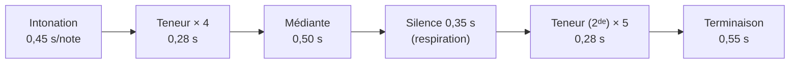
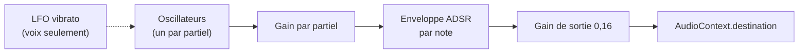
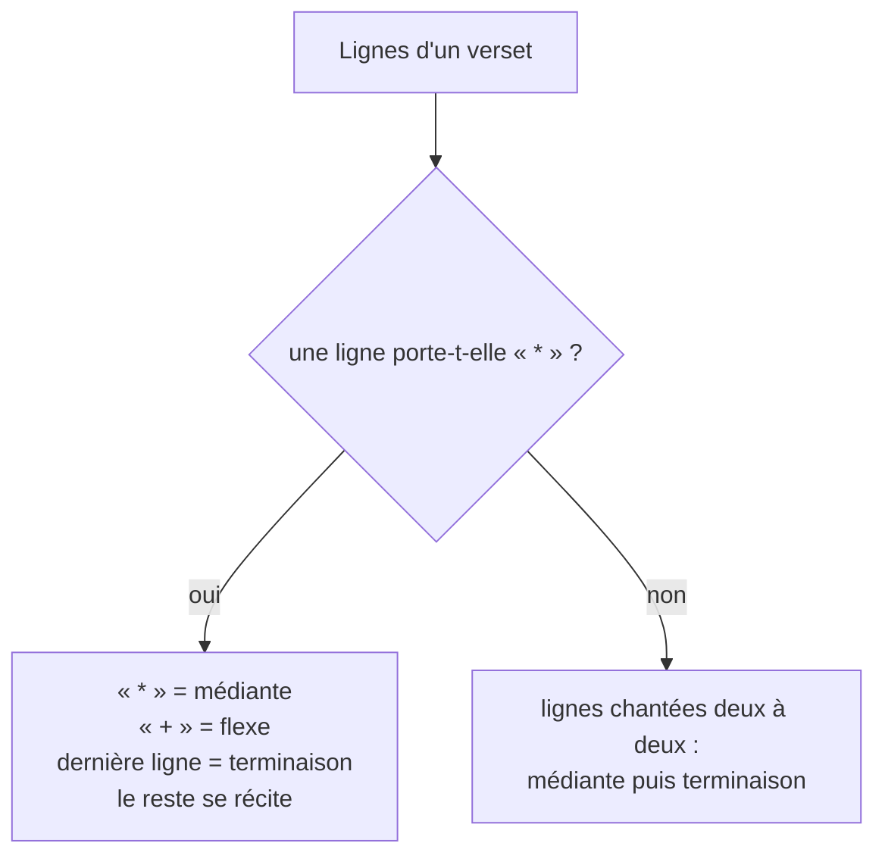

# SPEC-04 — Psalmodie

## Portée de la fonction

Apprendre à psalmodier. Trois niveaux, du plus abstrait au plus concret :

1. **La formule seule** — feuille « Psalmodie » : le ton choisi, sa portée, son
   écoute. Utile pour entonner.
2. **Le texte pointé** — chaque psaume et chaque cantique s'affiche avec le
   pointage explicité : trait de récitation sur la teneur, nom des notes
   au-dessus des syllabes de cadence, marques `+` et `*` mises en évidence.
3. **Le chant suivi** — un bouton par psaume et un bouton par verset chantent le
   texte sur le ton choisi en surlignant la syllabe en cours.

Les formules restent volontairement simplifiées (une cadence courante par ton,
pas l'ensemble des différences), ce que l'interface indique.

> [!NOTE]
> **Le ton ne se déduit pas des données.** En usage, c'est l'antienne qui
> commande le ton : son mode l'impose, et la terminaison retenue ramène à sa
> première note. L'AELF publie le texte des antiennes, jamais leur mélodie —
> le choix revient donc à l'utilisateur, et l'application le mémorise par
> office. Voir [Psautier et tons psalmodiques](../fondations/psautier-et-tons.md).

## Les neuf tons

| `id` | Nom | Mode | Intonation | Teneur | Médiante | Terminaison |
| --- | --- | --- | --- | --- | --- | --- |
| `I` | Ton I | Ré, teneur La | ré fa sol la | la | la sol fa sol | la sol fa mi ré |
| `II` | Ton II | Ré, teneur Fa | do ré fa | fa | fa mi ré fa | fa mi ré do ré |
| `III` | Ton III | Mi, teneur Do | sol la do | do | do si do la | do si la sol la |
| `IV` | Ton IV | Mi, teneur La | mi fa sol la | la | la sol fa sol | sol la sol fa mi |
| `V` | Ton V | Fa, teneur Do | fa la do | do | do si do la | do la sol fa |
| `VI` | Ton VI | Fa, teneur La | fa sol la | la | la sol fa sol | sol fa mi fa |
| `VII` | Ton VII | Sol, teneur Ré | sol la si ré | ré | ré do si do | ré do si la sol |
| `VIII` | Ton VIII | Sol, teneur Do | sol la do | do | do si do la | do si la sol |
| `peregrinus` | Tonus peregrinus | Ré, deux teneurs | sol la do | la puis **sol** | do si la | sol fa mi ré |

Les notes sont écrites en notation anglaise avec octave dans le code (`A4` = la
du diapason). Le *tonus peregrinus* est le seul à changer de teneur au second
hémistiche (champ `teneurSeconde`).

## Séquence jouée

`sequence(ton)` développe la formule en un verset type :



Les durées sont divisées par le facteur `allure` (1 par défaut). La répétition de
la teneur figure la récitation, dont la longueur varie en réalité avec le texte.

## Hauteur

`frequence(note, transposition)` convertit vers le MIDI puis vers les hertz :

```
f = 440 × 2^((midi(note) + transposition − 69) / 12)
```

Le curseur **Hauteur** couvre −5 à +5 demi-tons, pour adapter le ton à la voix
de l'assemblée. Il n'est pas persisté (il vaut 0 à chaque ouverture) : la
transposition dépend de qui chante ce jour-là, pas d'une préférence durable.

## Portée de repère

SVG dessiné à la main, sans bibliothèque.

| Élément | Règle |
| --- | --- |
| Lignes | 5, espacées de 11 unités |
| Placement vertical | Position diatonique (do = 0 … si = 6, plus 7 par octave), une demi-interligne par degré |
| Cadrage | La portée est centrée sur l'ambitus du ton : `baseDegre = milieu(min, max) − 4` |
| Lignes supplémentaires | Tracées sous la portée pour les notes deux degrés sous la ligne du bas |
| Têtes de note | Ellipses 5,2 × 4 ; la teneur est en teinte liturgique, le reste en encre |
| Étiquettes | `Intonation`, `Teneur`, `Médiante`, `Teneur`, `Terminaison`, centrées sous chaque groupe |
| Accessibilité | `role="img"` et `aria-label` : « Formule du Ton II, teneur fa » |

Le cadrage dynamique évite qu'un ton grave (II) se retrouve entièrement sous la
portée et qu'un ton aigu (VII) en déborde par le haut.

## Synthèse sonore

Trois timbres additifs, chacun défini par ses partiels et son enveloppe :

| Instrument | Partiels (rang × poids) | Forme | Attaque | Chute | Tenue | Relâche | Particularité |
| --- | --- | --- | --- | --- | --- | --- | --- |
| Piano | 1×1 · 2×0,32 · 3×0,14 · 4×0,06 | triangle | 6 ms | 280 ms | 0,25 | 350 ms | décroissance marquée |
| Orgue | 1×0,8 · 2×0,5 · 3×0,25 · 4×0,2 · 6×0,1 | sinus | 60 ms | 80 ms | 0,85 | 220 ms | son tenu |
| Voix | 1×1 · 2×0,18 · 3×0,08 | sinus | 90 ms | 120 ms | 0,80 | 300 ms | vibrato 5 Hz, ±3,2 Hz, installé en 250 ms |



Règles d'exécution :

- Le contexte audio est créé à la première écoute et repris (`resume()`) s'il est
  suspendu — les navigateurs mobiles exigent un geste utilisateur, et le bouton
  « Écouter le ton » en est un.
- Toute la séquence est **planifiée d'avance** sur l'horloge audio : ni
  minuterie de rendu, ni dérive.
- Une nouvelle écoute arrête la précédente (`arreter()` : rampe de 80 ms vers le
  silence, pour éviter le claquement).
- `surFin` est appelé aussi bien à la fin naturelle qu'à l'arrêt manuel : le
  bouton reste synchronisé.
- Sans `AudioContext` (navigateur trop ancien, contexte restreint), l'écoute est
  refusée avec un message ; le reste de l'application n'est pas affecté.

## Pointage et chant du texte

### Ce que fournit l'AELF

Le texte des offices est déjà pointé, et c'est ce pointage que l'application
explicite plutôt que d'en inventer un :

| Élément du texte | Sens | Usage |
| --- | --- | --- |
| `<br>` | Fin d'hémistiche | Découpe les lignes du verset |
| `<span class="verse_number">` | Début de verset | Regroupe les lignes |
| `<u>` autour d'une voyelle | Accent tonique qui porte la cadence | Point de départ de la médiante, de la terminaison ou de la flexe |
| `*` en fin de ligne | Médiante | Ferme le premier hémistiche |
| `+` en fin de ligne | Flexe | La voix descend d'un degré |

Le psaume responsorial de la messe n'est pas pointé : à défaut d'accent marqué,
la cadence prend les trois dernières syllabes de la ligne, et les versets se
regroupent par strophe.

### Attribution des cadences



### Attribution des notes

Pour chaque ligne, depuis la syllabe accentuée :

| Cadence | Règle |
| --- | --- |
| Récitation | Toutes les syllabes sur la teneur, jusqu'à l'accent |
| Flexe (`+`) | L'accent reste sur la teneur, les syllabes suivantes descendent sur la note de flexe |
| Médiante (`*`) | La formule de médiante s'étale de l'accent à la fin de la ligne |
| Terminaison | Idem avec la formule de terminaison |

L'étalement respecte deux principes : la dernière note tombe toujours sur la
dernière syllabe ; s'il reste plus de syllabes que de notes, la dernière note se
prolonge ; s'il en reste moins, la formule est resserrée en gardant son début et
sa note finale. L'intonation n'est chantée qu'au premier verset, et le *tonus
peregrinus* bascule sur sa seconde teneur après la médiante.

### Découpage syllabique

`data/syllabes.js` applique les règles scolaires du français : groupes
vocaliques indivisibles, groupes consonne + `l`/`r` soudés à la voyelle
suivante, `e` muet final rattaché à la syllabe précédente, et loi de position
(`pri-ère` mais `pied`). La précision n'a d'enjeu que sur les dernières syllabes
d'une ligne : la récitation se chante de toute façon sur une seule note.

**Garde-fou** : le texte reconstruit à partir des syllabes est comparé au texte
de l'AELF, blancs exclus. Au moindre écart, l'application renonce au pointage et
affiche le psaume ordinairement — un texte liturgique ne doit jamais être abîmé
par un traitement d'affichage.

### Chant suivi

La suite de notes est programmée d'avance sur l'horloge audio ; l'interface lit
`AudioContext.currentTime` à chaque frame pour surligner la syllabe en cours, ce
qui interdit toute dérive entre le son et le texte. La syllabe suivie est
ramenée à l'écran si elle en sort.

## Points d'entrée

| Depuis | Comportement |
| --- | --- |
| Bouton ♪ de la barre du haut | Ouvre la feuille avec le ton enregistré |
| Bouton « Chanter » sous un psaume | Chante le psaume entier, syllabe après syllabe |
| Bouton ▶ devant un verset | Chante ce seul verset (avec intonation s'il s'agit du premier) |
| Bouton « Ton … » de la barre du psaume | Ouvre la feuille sans changer le ton |
| Tiroir « Paramètres » › Psalmodie | Ton, instrument, affichage des notes, allure du chant |

## Limites assumées

- Une seule différence (terminaison) par ton, alors que la tradition en compte
  plusieurs par mode.
- Le tonus peregrinus est réduit à sa double teneur.
- Le découpage syllabique est heuristique : il peut se tromper sur des mots
  rares, sans conséquence sur la récitation, à la marge sur une cadence.
- Les antiennes, hymnes et répons ne sont pas chantés : ils ont leurs propres
  mélodies, qui ne se déduisent pas d'un ton psalmodique.

Ces limites sont énoncées dans l'interface (« aides à l'intonation,
simplifiées ») afin de ne pas laisser croire à une notation critique.
