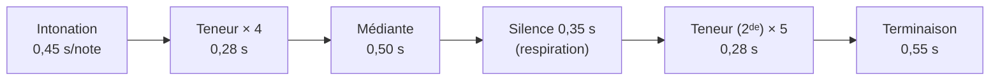
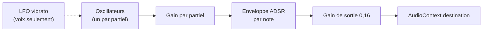

# SPEC-04 — Psalmodie

## Portée de la fonction

Donner le ton : entendre la formule d'un ton psalmodique avant de chanter un
psaume, et la voir sur une portée. Ce n'est **pas** un lecteur de partitions ni un
moteur de chant : les formules sont volontairement simplifiées (une cadence
courante par ton, pas l'ensemble des différences), ce que l'interface indique.

## Les neuf tons

| `id` | Nom | Mode | Intonation | Teneur | Médiante | Terminaison |
| --- | --- | --- | --- | --- | --- | --- |
| `I` | Ton I | Ré, teneur La | ré fa sol la | la | la sol fa sol | la sol fa mi ré |
| `II` | Ton II | Ré, teneur Fa | do ré fa | fa | fa mi ré fa | fa mi ré do ré |
| `III` | Ton III | Mi, teneur Do | sol la do | do | do si do la | do si la sol la |
| `IV` | Ton IV | Mi, teneur La | mi fa sol la | la | la sol fa sol | sol la sol fa mi |
| `V` | Ton V | Fa, teneur Do | fa la do | do | do si do la | do la sol fa |
| `VI` | Ton VI | Fa, teneur La | fa sol la | la | la sol fa sol | sol fa mi fa |
| `VII` | Ton VII | Sol, teneur Ré | sol la si ré | ré | ré do si do | ré do si la sol |
| `VIII` | Ton VIII | Sol, teneur Do | sol la do | do | do si do la | do si la sol |
| `peregrinus` | Tonus peregrinus | Ré, deux teneurs | sol la do | la puis **sol** | do si la | sol fa mi ré |

Les notes sont écrites en notation anglaise avec octave dans le code (`A4` = la
du diapason). Le *tonus peregrinus* est le seul à changer de teneur au second
hémistiche (champ `teneurSeconde`).

## Séquence jouée

`sequence(ton)` développe la formule en un verset type :



Les durées sont divisées par le facteur `allure` (1 par défaut). La répétition de
la teneur figure la récitation, dont la longueur varie en réalité avec le texte.

## Hauteur

`frequence(note, transposition)` convertit vers le MIDI puis vers les hertz :

```
f = 440 × 2^((midi(note) + transposition − 69) / 12)
```

Le curseur **Hauteur** couvre −5 à +5 demi-tons, pour adapter le ton à la voix
de l'assemblée. Il n'est pas persisté (il vaut 0 à chaque ouverture) : la
transposition dépend de qui chante ce jour-là, pas d'une préférence durable.

## Portée de repère

SVG dessiné à la main, sans bibliothèque.

| Élément | Règle |
| --- | --- |
| Lignes | 5, espacées de 11 unités |
| Placement vertical | Position diatonique (do = 0 … si = 6, plus 7 par octave), une demi-interligne par degré |
| Cadrage | La portée est centrée sur l'ambitus du ton : `baseDegre = milieu(min, max) − 4` |
| Lignes supplémentaires | Tracées sous la portée pour les notes deux degrés sous la ligne du bas |
| Têtes de note | Ellipses 5,2 × 4 ; la teneur est en teinte liturgique, le reste en encre |
| Étiquettes | `Intonation`, `Teneur`, `Médiante`, `Teneur`, `Terminaison`, centrées sous chaque groupe |
| Accessibilité | `role="img"` et `aria-label` : « Formule du Ton II, teneur fa » |

Le cadrage dynamique évite qu'un ton grave (II) se retrouve entièrement sous la
portée et qu'un ton aigu (VII) en déborde par le haut.

## Synthèse sonore

Trois timbres additifs, chacun défini par ses partiels et son enveloppe :

| Instrument | Partiels (rang × poids) | Forme | Attaque | Chute | Tenue | Relâche | Particularité |
| --- | --- | --- | --- | --- | --- | --- | --- |
| Piano | 1×1 · 2×0,32 · 3×0,14 · 4×0,06 | triangle | 6 ms | 280 ms | 0,25 | 350 ms | décroissance marquée |
| Orgue | 1×0,8 · 2×0,5 · 3×0,25 · 4×0,2 · 6×0,1 | sinus | 60 ms | 80 ms | 0,85 | 220 ms | son tenu |
| Voix | 1×1 · 2×0,18 · 3×0,08 | sinus | 90 ms | 120 ms | 0,80 | 300 ms | vibrato 5 Hz, ±3,2 Hz, installé en 250 ms |



Règles d'exécution :

- Le contexte audio est créé à la première écoute et repris (`resume()`) s'il est
  suspendu — les navigateurs mobiles exigent un geste utilisateur, et le bouton
  « Écouter le ton » en est un.
- Toute la séquence est **planifiée d'avance** sur l'horloge audio : ni
  minuterie de rendu, ni dérive.
- Une nouvelle écoute arrête la précédente (`arreter()` : rampe de 80 ms vers le
  silence, pour éviter le claquement).
- `surFin` est appelé aussi bien à la fin naturelle qu'à l'arrêt manuel : le
  bouton reste synchronisé.
- Sans `AudioContext` (navigateur trop ancien, contexte restreint), l'écoute est
  refusée avec un message ; le reste de l'application n'est pas affecté.

## Points d'entrée

| Depuis | Comportement |
| --- | --- |
| Bouton ♪ de la barre du haut | Ouvre la feuille avec le ton enregistré |
| Bouton « Donner le ton » sous un psaume ou un cantique | Même feuille, sans changer le ton choisi |
| Tiroir « Paramètres » › Psalmodie | Change le ton et l'instrument par défaut |

## Limites assumées

- Une seule différence (terminaison) par ton, alors que la tradition en compte
  plusieurs par mode.
- Aucune adaptation au texte : ni découpe des hémistiches, ni gestion des
  accents et syllabes préparatoires.
- Le tonus peregrinus est réduit à sa double teneur.

Ces limites sont énoncées dans l'interface (« aides à l'intonation,
simplifiées ») afin de ne pas laisser croire à une notation critique.
