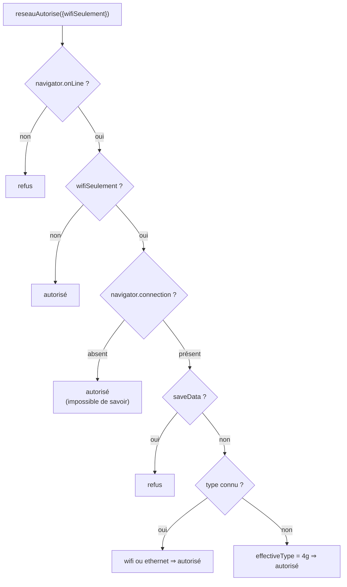

# SPEC-05 — Fonctionnement hors connexion

## Ce qui est garanti sans réseau

| Élément | Disponible hors ligne ? | Grâce à |
| --- | --- | --- |
| Coquille de l'application (HTML, JS, CSS, icônes) | Oui, dès la première visite terminée | Précache du service worker |
| Réglages | Oui | `localStorage` |
| Textes d'un office déjà consulté | Oui | Réserve IndexedDB |
| Textes préchargés (jours à venir) | Oui | Préchargement + réserve |
| Textes jamais consultés ni préchargés | Non | Écran « Texte indisponible hors connexion » |
| Psalmodie (portée et son) | Oui | Formules et synthèse embarquées |

## Réglages et effets

| Réglage | Effet exact |
| --- | --- |
| **Contenu conservé** | Détermine la liste d'offices du préchargement : `aucun` → rien ; `messe` → la messe ; `offices` → les 7 heures ; `messe+offices` → les 8. **N'efface rien** de ce qui est déjà en réserve |
| **Jours téléchargés à l'avance** | `N` ⇒ le jour de départ **plus** `N` jours ; `0` limite au jour de départ |
| **Télécharger à l'avance › Lancer** | Préchargement immédiat à partir de la **date affichée** |
| **Conserver les textes** | Ancienneté maximale d'une entrée, appliquée au démarrage ; `Toujours` désactive la purge |
| **WiFi uniquement** | Bride le préchargement **automatique** ; le bouton « Lancer » reste un geste explicite et passe outre, avec un message |
| **Purger le cache** | Vide la réserve IndexedDB et les caches `aelf-*`. La coquille est conservée : l'application reste lançable hors ligne |

Volume à prévoir : un office pèse de 30 à 80 ko de JSON. « Messe + Offices » sur
8 jours représente environ 64 requêtes, soit quelques mégaoctets — l'ordre de
grandeur affiché par « N textes en réserve · X,X Mo ».

## Détection du réseau

Le choix d'autoriser quand l'information manque est délibéré : mieux vaut un
téléchargement de quelques centaines de kilo-octets qu'un mode hors connexion
qui ne se remplit jamais sur un navigateur qui n'expose pas `connection`.

## Déroulé du préchargement

1. Construction de la liste des couples (office, date) : `contenu` × `jours + 1`.
2. Pour chaque couple, dans l'ordre :
   - arrêt net si `navigator.onLine` devient faux ;
   - saut si le texte est déjà en réserve (`estEnCache`) ;
   - sinon `chargerOffice()`, dont l'échec est absorbé (le jour suivant continue) ;
   - rappel de progression (fraction, nombre d'ajouts).
3. Bilan `{ajoutes, total}` → message et rafraîchissement des pastilles.

Le parcours est **séquentiel** : il ménage l'API et la batterie, et laisse le
rendu fluide.

## Service worker

Cycle de vie et stratégies : voir
[architecture 03 — Flux](../architecture/03-flux.md#mise-à-jour-de-lapplication)
et [architecture 04 — Stockage](../architecture/04-stockage.md#cache-api--la-coquille-et-les-réponses-réseau).

Points spécifiés ici :

| Aspect | Décision |
| --- | --- |
| Enregistrement | Production uniquement (`import.meta.env.PROD`), sur l'événement `load` |
| Portée | `/` |
| Précache | Liste réelle des fichiers de `docs/` injectée au build, `.map` et `.txt` exclus, avec `cache: 'reload'` pour ne pas figer une réponse déjà périmée |
| Activation | `skipWaiting()` + `clients.claim()` ; les caches `coquille-*` d'autres versions sont supprimés |
| Requêtes non-GET | Ignorées |
| Navigation hors ligne | `/index.html`, puis `/`, puis réponse 503 « Hors connexion » en texte brut |
| Message `passer-en-actif` | Déclenche `skipWaiting()` — réservé à un futur bouton « Recharger maintenant » |

En développement, le service worker n'est **pas** enregistré : un cache de
coquille rendrait le rechargement à chaud illisible. Le mode hors connexion se
teste donc avec `npm run build && npm run preview`.

## Vérifications effectuées

| Scénario | Méthode | Résultat |
| --- | --- | --- |
| Lecture d'un office avec réserve vide | Profil navigateur neuf | Requête réseau, affichage, mise en réserve |
| Relecture du même office | Seconde visite | Servi par la réserve, sans requête |
| Coupure totale du réseau puis rechargement | `Network.emulateNetworkConditions offline:true` + `Page.reload` | Coquille servie par le service worker, office lu depuis IndexedDB |
| IndexedDB indisponible | Chromium sans profil persistant | Garde-fou de 3 s, puis lecture en ligne — aucun blocage |
| Préchargement automatique | Démarrage avec réglages par défaut | 8 offices × 4 jours mis en réserve, pastilles vertes dans le tiroir |
